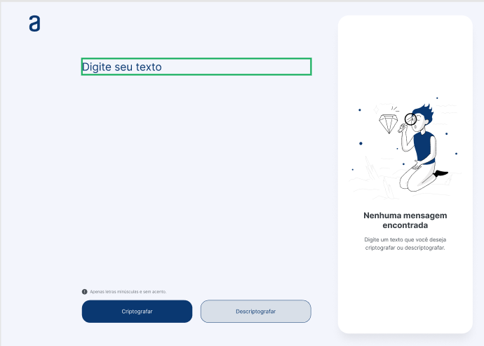

# #1 Challenge One Next Education

## Sprint 01: Construa um decodificador de texto com Javascript

## **Modelo**

~~~css
    Pagina inicial{
    height: 1024px;
    width: 1440px;
    } 
~~~  

## Notas:

**Recursos:**

- [**Figma**](https://www.figma.com/file/tvFEYhVfZTjdJ5P24RGV21/Alura-Challenge---Desafio-1---L%C3%B3gica?node-id=16%3A802)
